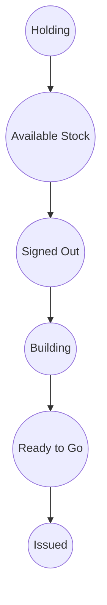
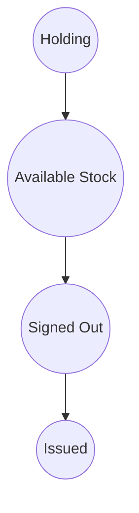

# WORKFLOW_README.md

## Asset Management Workflow

This document explains how assets are managed within the application, including their lifecycle, possible states, and how transitions between states are handled.

---

## 1. Asset Lifecycle Overview

Assets in the system represent physical or digital items tracked by the organization. Each asset moves through a series of states from creation/import to assignment and use. The workflow depends on the asset type.

### Typical Asset Lifecycle (by Asset Type):

#### For Desktops, Laptops, Tablets, and Phones (Devices that require building):

1. **Holding**: Asset is in holding area (e.g., just imported, not yet tagged).
2. **Available Stock**: Stock that is available to be signed out.
3. **Signed Out**: Asset is taken from stock for configuration/building.
4. **Building**: Asset is being configured or built.
5. **Ready to Go**: Device has completed building and is configured for deployment.
6. **Issued**: Asset is assigned to a person or location.

#### For Monitors (No build required):

1. **Holding**: Asset is in holding area (e.g., just imported, not yet tagged).
2. **Available Stock**: Stock that is available to be signed out.
3. **Signed Out**: Asset is taken from stock.
4. **Issued**: Asset is assigned to a person or location.

---

## 2. Asset States

| State           | Description                                                     |
| --------------- | --------------------------------------------------------------- |
| Holding         | Asset is in holding area (e.g., just imported, not yet tagged). |
| Available Stock | Stock that is available to be signed out.                       |
| Signed Out      | Asset is taken from stock.                                      |
| Building        | Asset is being configured.                                      |
| Ready to Go     | Device has completed building and is ready for deployment.      |
| Issued          | Asset is assigned to a person or location.                      |

_Note: Only these states are used in the application. The workflow for each asset type determines which states are used and in what order._

---

## 3. State Transitions

### Devices (Desktops, Laptops, Tablets, Phones)

### Monitors

**Explanation:**

- **Devices**: Must be built/configured before being issued. They follow the full workflow: Holding → Available Stock → Signed Out → Building → Ready to Go → Issued.
- **Monitors**: Do not require building. They follow a shorter workflow: Holding → Available Stock → Signed Out → Issued.

---

## 4. How State Transitions Are Managed

- **Backend Logic**: State transitions are enforced in the backend API (see `/api/assets` and related routes). Only valid transitions are allowed based on asset type.
- **Frontend UI**: The UI presents actions (e.g., sign out, build, issue) based on the current state and asset type. Invalid transitions are not shown to the user.
- **Bulk Import**: Imported assets are always placed in the Holding state initially, as seen in `frontend/app/imports/page.tsx`.
- **Audit Trail**: All state changes are logged for traceability (see asset history components).

---

## 5. Example: Bulk Import Workflow

1. Admin imports assets via CSV/XLSX.
2. Imported assets appear in the Holding state ("IT Department - Store room").
3. For devices, assets move to Available Stock, are signed out, built, marked as ready, and then issued.
4. For monitors, assets move to Available Stock, are signed out, and then issued directly.

---

## 6. Additional Notes

- Only users with appropriate permissions (e.g., Admin) can perform certain transitions (e.g., issue assets).
- The system ensures data integrity by preventing invalid transitions.
- All state labels and logic are centralized in the codebase for consistency.
- The workflow is determined by the asset type (devices vs. monitors).

---

## 7. References

- `frontend/app/imports/page.tsx` – Bulk import logic and state assignment
- `@/lib/constants` – Asset state labels
- `@/lib/types` – AssetState enum
- Asset detail/history components – For tracking state changes

---

<!--
Reasoning:
- This document now accurately reflects the real asset states and workflows for different asset types, including the 'Available Stock' state.
- Mermaid diagrams have been updated to show the correct transitions for devices and monitors.
- Explanatory comments and sections ensure clarity for all team members.
-->
