# INTERACTIONS.md

## Overview

This document details the interactions between frontend components, backend APIs, and the database in the Asset Management System dashboard and related features. It covers how data flows from the database to the UI, which APIs are involved, and how components communicate.

---

## 1. Frontend-Backend Interactions

- The dashboard page (`DashboardPage`) is server-side rendered (SSR) and fetches all required data via the `getDashboardData` function.
- `getDashboardData` aggregates statistics, recent activity, asset counts by type/state, and more by querying the database using Drizzle ORM.
- The dashboard page passes this data as props to its child components:
  - `DashboardStats`: Shows summary cards (total assets, available, building, ready to go, issued, etc.)
  - `AssetsByType`: Visualizes asset counts by type
  - `BuildingAssetsCard` and `ReadyToGoAssetsCard`: Show breakdowns by type for assets in "BUILDING" and "READY_TO_GO" states
  - `RecentActivity`: Displays the latest asset history events
  - `QuickActions`: Placeholder for future dashboard actions

---

## 2. API Endpoints

- `/api/dashboard`: Returns all dashboard data in a single request (calls `getDashboardData`)
- `/api/assets`: CRUD and search for assets (with filtering, pagination, etc.)
- `/api/assets/[assetNumber]`: Fetches details for a single asset
- `/api/assets/[assetNumber]/history`: Fetches asset history
- `/api/assets/building-by-type`: (legacy) Returns count of assets in 'BUILDING' state by type
- `/api/assets/ready-to-go-by-type`: (legacy) Returns count of assets in 'READY_TO_GO' state by type
- `/api/holding-assets`: Returns all assets in holding (imported) status
- `/api/reports/asset-inventory/summary`: Aggregated asset stats for reporting
- `/api/users/[userId]` and `/api/users/by-employee-id/[employeeId]`: Fetch user and their assigned assets
- `/api/search`: Global search across assets, users, and locations

---

## 3. Data Aggregation (getDashboardData)

- Aggregates:
  - Total assets, users, locations, value
  - Asset counts by state and by type
  - Recent activity (last 5 asset history events)
  - Pending holding assets
  - Building and Ready To Go assets by type
- Uses a single transaction for consistency
- Maps DB state variants to canonical dashboard states

---

## 4. Diagram: Component & API/Data Flow

```mermaid
flowchart TD
  subgraph "Frontend"
    DashboardPage["DashboardPage (SSR)"]
    DashboardStats["DashboardStats"]
    AssetsByType["AssetsByType"]
    BuildingAssetsCard["BuildingAssetsCard"]
    ReadyToGoAssetsCard["ReadyToGoAssetsCard"]
    RecentActivity["RecentActivity"]
    QuickActions["QuickActions"]
  end

  subgraph "Backend"
    getDashboardData["getDashboardData (lib/db/dashboard.ts)"]
    DB["Database (Drizzle ORM)"]
    API_Dashboard["/api/dashboard"]
    API_Assets["/api/assets"]
    API_AssetDetail["/api/assets/[assetNumber]"]
    API_AssetHistory["/api/assets/[assetNumber]/history"]
    API_BuildingByType["/api/assets/building-by-type"]
    API_ReadyToGoByType["/api/assets/ready-to-go-by-type"]
    API_HoldingAssets["/api/holding-assets"]
    API_ReportsSummary["/api/reports/asset-inventory/summary"]
    API_Users["/api/users/[userId]"]
    API_UsersByEmp["/api/users/by-employee-id/[employeeId]"]
    API_Search["/api/search"]
  end

  DashboardPage -->|SSR fetch| getDashboardData
  getDashboardData -->|queries| DB
  DashboardPage --> DashboardStats
  DashboardPage --> AssetsByType
  DashboardPage --> BuildingAssetsCard
  DashboardPage --> ReadyToGoAssetsCard
  DashboardPage --> RecentActivity
  DashboardPage --> QuickActions

  DashboardStats -->|props| DashboardPage
  AssetsByType -->|props| DashboardPage
  BuildingAssetsCard -->|props| DashboardPage
  ReadyToGoAssetsCard -->|props| DashboardPage
  RecentActivity -->|props| DashboardPage

  API_Dashboard --> getDashboardData
  API_Assets --> DB
  API_AssetDetail --> DB
  API_AssetHistory --> DB
  API_BuildingByType --> DB
  API_ReadyToGoByType --> DB
  API_HoldingAssets --> DB
  API_ReportsSummary --> DB
  API_Users --> DB
  API_UsersByEmp --> DB
  API_Search --> DB
```

---

## 5. Notes

- All dashboard data is now fetched server-side for reliability and performance.
- Legacy client-side API endpoints are still available for other uses but are not used by the dashboard.
- The system uses Drizzle ORM for all database access, ensuring type safety and maintainability.
- For more details on each API, see the corresponding route files in `frontend/app/api/`. 
