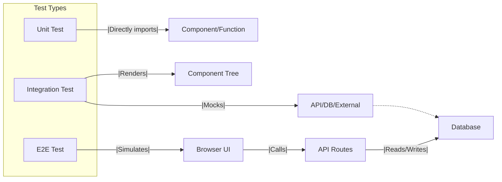

# TESTING_README.md

> **Project Testing Guide**

This document explains the testing setup, philosophy, and execution for this project. It covers:

- Test frameworks and libraries
- File structure and conventions
- How to run tests
- How tests interact with the system
- Troubleshooting common issues
- Code coverage

---

## 1. Testing Philosophy

- **Comprehensive:** We aim for high coverage of all components, hooks, and API endpoints.
- **Meaningful:** Tests should verify real user behavior and business logic, not just implementation details.
- **Maintainable:** Tests should be easy to read, update, and extend.
- **Fast Feedback:** Tests should run quickly and reliably in local and CI environments.

---

## 2. Frameworks & Libraries

- **Jest**: Main test runner for unit and integration tests.
- **React Testing Library**: For testing React components in a user-centric way.
- **Babel**: Transpiles TypeScript and JSX for Jest.
- **Playwright/Cypress** (optional): For end-to-end (E2E) tests (not included by default).

---

## 3. File Structure & Conventions

- **Test files** are placed next to the files they test, or in a `__tests__` subfolder.
- **Naming:**
  - Component: `ComponentName.tsx`
  - Test: `ComponentName.test.tsx`
  - API route: `route.test.ts`
- **Mocks:**
  - External dependencies (e.g., Supabase, Chart.js) are mocked in test files.

**Example Structure:**

```
frontend/
  components/
    ui/
      button.tsx
      button.test.tsx
  app/
    locations/
      page.tsx
      page.test.tsx
  lib/
    test-utils.tsx
```

---

## 4. Running Tests

### Run all tests

```powershell
yarn test
```

### Run tests in watch mode

```powershell
yarn test --watch
```

### Run a specific test file

```powershell
yarn test frontend/app/locations/page.test.tsx
```

### Generate coverage report

```powershell
yarn test --coverage
```

---

## 5. Test Execution Flow

```mermaid
graph TD
  A[Start: Run yarn test] --> B[Jest loads config & Babel]
  B --> C[Finds all *.test.tsx files]
  C --> D[Transpiles with Babel (JSX, TS)]
  D --> E[Runs tests with React Testing Library]
  E --> F[Mocks external dependencies]
  F --> G[Runs assertions]
  G --> H[Reports results & coverage]
```

---

## 6. How Tests Interact with the System



- **Unit tests**: Test individual functions/components in isolation.
- **Integration tests**: Test how components work together, often with mocks for APIs or DB.
- **E2E tests**: (Optional) Simulate real user flows in the browser.

---

## 7. Troubleshooting

- **JSX/React errors:** Ensure Babel is configured with `@babel/preset-react` and `runtime: 'automatic'`.
- **Out-of-scope variables in jest.mock:** Use `const React = require('react')` inside mock factories if needed.
- **TypeScript errors:** Check that `tsconfig.json` and Babel presets are correct.
- **Mocking issues:** Use Jest's mocking APIs to stub external modules.

---

## 8. Code Coverage

- Run `yarn test --coverage` to generate a coverage report.
- Coverage reports are output to the `coverage/` directory.
- Aim for high coverage, but focus on meaningful tests over 100% coverage.

---

## 9. Best Practices

- Use descriptive test names.
- Mock external dependencies (e.g., Supabase, Chart.js) in tests.
- Prefer user-centric assertions (what the user sees/does).
- Keep tests small and focused.
- Clean up after each test (reset mocks, clear data).

---

## 10. References

- [Jest Documentation](https://jestjs.io/docs/getting-started)
- [React Testing Library](https://testing-library.com/docs/react-testing-library/intro/)
- [Babel](https://babeljs.io/docs/en/)

---

> For any issues or improvements, please update this README or contact the maintainers.
